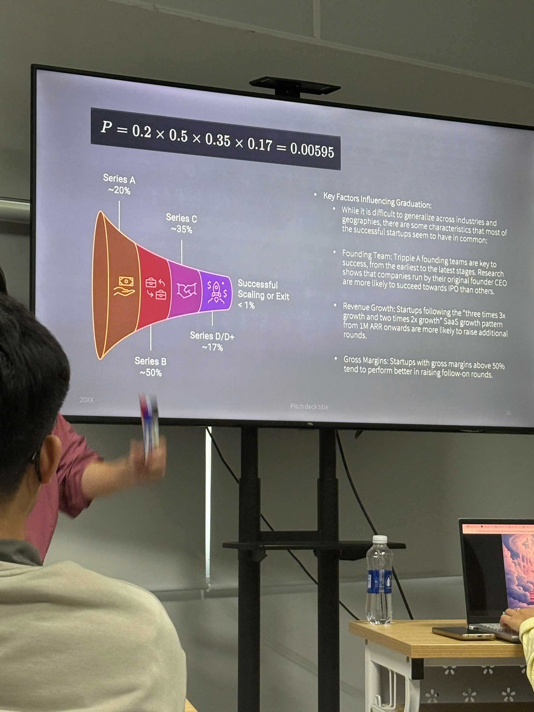

#exe #checkpoint4 
# Cơ chế
- Chiếm 40% điểm

# Cực kỳ hạn chế
- "EM NGHĨ LÀ": Cho ra cảm giác ko chắc chắn

# Thuế thu nhập doanh nghiệp (Corporate income tax)
![![ ExperientialEntrepreneurship1/Checkpoint 4/#*Table]]
- Thuế thu nhập doanh nghiệp được tính theo năm tài chính
- Nếu thành lập công ty dữ năm thì thuế chỉ tính từ  thời điểm thành lập đến 31/12

# P&L (Profit & Loss)

# Valuation - các phương pháp định giá doanh nghiệp
### Comparable - Phương pháp so sánh
### Capital Based - Cost + Expense
- Thay vì đi làm thì bạn đã bỏ vô dự án được bao nhiêu tiền 
### Score Card (3rd party)
- Người ta sẽ có thẻ điểm 
	- Team sáng lập: ?? điểm
	- Công nghệ: ???
- So sánh điểm tổng với các tổng điểm nhóm khác và nhân với số tiền
### DCF - Lãi kép - Kỳ quan thế giới thứ 8
> [!NOTE]
    > FV1 = PV (1+r)

# Fund Raising - Gọi vốn
> Cho doanh nghiệp của bạn ăn cơm, ăn rau hay ăn thuốc tăng trưởng. Đó chính là phần gọi vốn - nuôi sống và nuôi lớn cho doanh nghiệp của bạn

### Year
> Em cần từng này tiền để nếu em không có lãi thì em vẫn sống được
> Đó là kịch bản xẩu nhất - vì thế em cần tiền để có thể sinh tồn và đợi tín hiệu của thị trường
- Cần 1 - 2 hay cả 3 năm để đốt tiền giữ doanh nghiệp sinh tồn
### Purpose
### Dilution - sự pha loãng quyền lợi

---
## Boot Strapping - Tiền tự bỏ ra

## Angels Investor
- Bama bank
- Friend
- Foolish: những kẻ gốc tin vào mình
## Loan

## Venture Capital - Quỹ đầu tư mạo hiểm
- Vì sao gọi các VC là cá mập ?
	- vì nó cắn, xé - đối lập hoàn toàn với Angel
- Sẽ nuốt chừng dần dần - 75% cổ phiếu công ty
- Lúc này họ sẽ trực tiếp tham gia điều hành doanh nghiệp - gần như nuốt chửng

### VC Series

> Rule of Thumb - Nguyên tắc ngón tay trỏ:
> Bạn 👍 thì mình đi
- Series A: 20%
- Series B: 20%
- Series C: 10%
- IPO (Series D/D+)

## Crowdfunding
## Sponsor

> Khi mới đầu bạn vừa thành lập thì ko thể tìm đến shark được
> Mỗi trạng thái doanh nghiệp nên được áp dụng với các phương thức gọi vốn phù hợp

